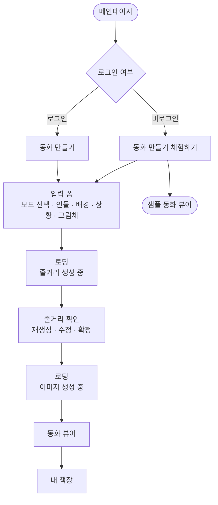
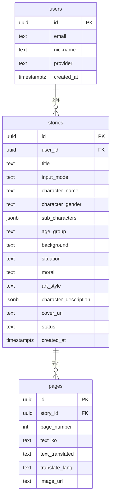

# 뚝딱동화

> 아이 이름 하나로 뚝딱! AI가 만들어 주는 나만의 맞춤 그림동화

[](https://yong275.github.io/ddukdong/)

---

## 소개

뚝딱동화는 아이가 주인공이 되는 AI 그림동화 생성 서비스입니다.
아이의 이름·나이·성별과 배경·상황·교훈을 입력하면 Solar AI가 동화를 쓰고, gpt-image-1이 그림을 그려요.

## 팀원 소개

| 이름 | 역할 | GitHub | 주요 개발 내용 |
|------|------|--------|--------------|
| 유용주 | 백엔드 | [@yong275](https://github.com/yong275) | 동화 줄거리 생성 LLM 파이프라인 설계 / 동화 이미지 생성 API 설계 및 연동 |
| 이소민 | 프론트엔드 | [@2-somin](https://github.com/2-somin) | 서비스 UI/UX 디자인 가이드라인 구축 |
| 신슬 | AI/모델링 | [@martiniblues](https://github.com/martiniblues) | 연령별 동화 생성 프롬프트 설계 |
| 구자성 | 백엔드 | [@magnetism9](https://github.com/magnetism9) | 회원가입·로그인 기능 구현 / 동화 저장 DB 구축 |

## 주요 기능

- **맞춤 동화 생성** — 아이 이름·성별·나이대, 배경, 상황, 교훈 입력 → 6~14컷 동화 자동 완성
- **캐릭터 시트** — Solar가 이야기에 맞는 주인공 외모(헤어·눈·피부·옷)를 생성, 전 페이지 일관된 그림체 유지
- **4가지 그림체** — 심플동화 / 수채화 / 종이공예 / 색연필
- **나이대 맞춤** — 4–6세·7–9세·10–12세별 문장 길이·컷 수·어휘 자동 조정
- **비로그인 체험** — 그림체별 샘플 동화로 흐름 체험 가능
- **내 책장** — 완성된 동화 영구 보관, PDF 내보내기

## 서비스 플로우



## 동화 생성 흐름

```
입력 (이름·배경·상황·교훈·그림체)
  ↓
Solar API — 동화 계획 생성 (plan)
  ↓
Solar API — 동화 본문 + 캐릭터 시트 생성 (write)
  ↓
줄거리 확인 · 수정 · 확정
  ↓
GPT-4o-mini — 페이지별 이미지 프롬프트 생성
  ↓
gpt-image-1 — 커버 + 전 페이지 이미지 병렬 생성
  ↓
동화 완성 → 뷰어
```

## 기술 스택

| 영역 | 기술 |
|------|------|
| 프론트엔드 | React 18, React Router v6, Zustand, Axios |
| 백엔드 | Express.js (Node.js) |
| 인증 / DB / 스토리지 | Supabase |
| 동화 생성 | Solar API (`solar-pro`) |
| 이미지 프롬프트 | GPT-4o-mini |
| 이미지 생성 | gpt-image-1 |
| 프론트 배포 | GitHub Pages |
| 백엔드 배포 | Render |

## ERD



## 배포

```bash
# 프론트 (GitHub Pages)
npm run deploy

# 백엔드 (Render)
# main 브랜치 push 시 자동 배포
```

---

리부트 AI 활용대회 출품작
